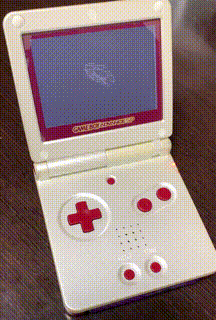

# gba

A collection of GBA programs.
- gba_simple : The most simple GBA program.
- gba_self : Try to use own crt0.s and ld linker script.
- gba_sample_01 : Draw random lines on screen.
- (work in progress) gba_sample_02 : Line drawing sample. (With fixed point math lib)
- gba_mode5 : GBA mode5 (160x128 16bits x 2) sample
  
